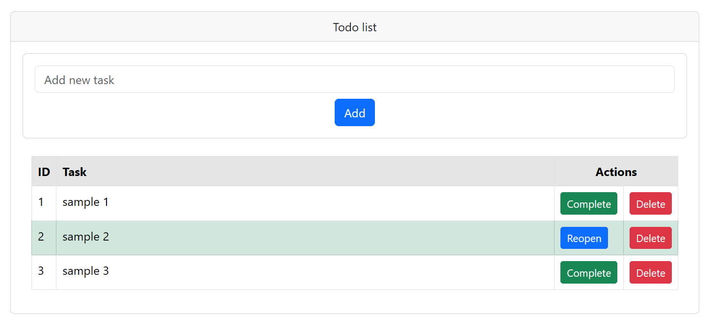

= ExpressJS Sample Todo app (Dockerized)
:toc:
:toc-levels: 5

== Description

An example of a Dockerized link:https://expressjs.com/[ExpressJS] Todo list app. Used as a guideline for building an
ExpressJS link:https://projectinit.sh/[ProjectInit] flow, but can also be used for learning.

== Preview

== Installation

Clone the repository:

[source,shell]
----
git clone git@github.com:constup/expressjs-sample-todo.git
----

Then start the Docker container

[source,shell]
----
docker compose up --build
----

=== Changing app port

The app uses port 3000 by default. If port 3000 is busy on your machine, you can use another port. To change the port:

- stop the container, if it's already running
- change the host port in `compose.yaml` (example: `"3004:3000"`)
- change the port in `BACKEND_URL` in link:html/js/main.js[main.js]
- run the container

== Tech stack

- Node 22 alpine image (https://github.com/nodejs/docker-node/blob/main/LICENSE[MIT License])
- ExpressJS 4 (link:https://github.com/expressjs/express/blob/master/LICENSE[MIT License])
- Bootstrap 5.3 (link:https://github.com/twbs/bootstrap/blob/main/LICENSE[MIT License])

== License

GNU GPL 3.0 or later

ExpressJS dockerized sample todo app

Copyright ©2025. Nikola Stojiljković

Copyright ©2025. constUP

This program is free software: you can redistribute it and/or modify
it under the terms of the GNU General Public License as published by
the Free Software Foundation, either version 3 of the License, or
(at your option) any later version.

This program is distributed in the hope that it will be useful,
but WITHOUT ANY WARRANTY; without even the implied warranty of
MERCHANTABILITY or FITNESS FOR A PARTICULAR PURPOSE.  See the
GNU General Public License for more details.

You should have received a copy of the GNU General Public License
along with this program.  If not, see <https://www.gnu.org/licenses/>.

link:LICENSE[LICENSE]
